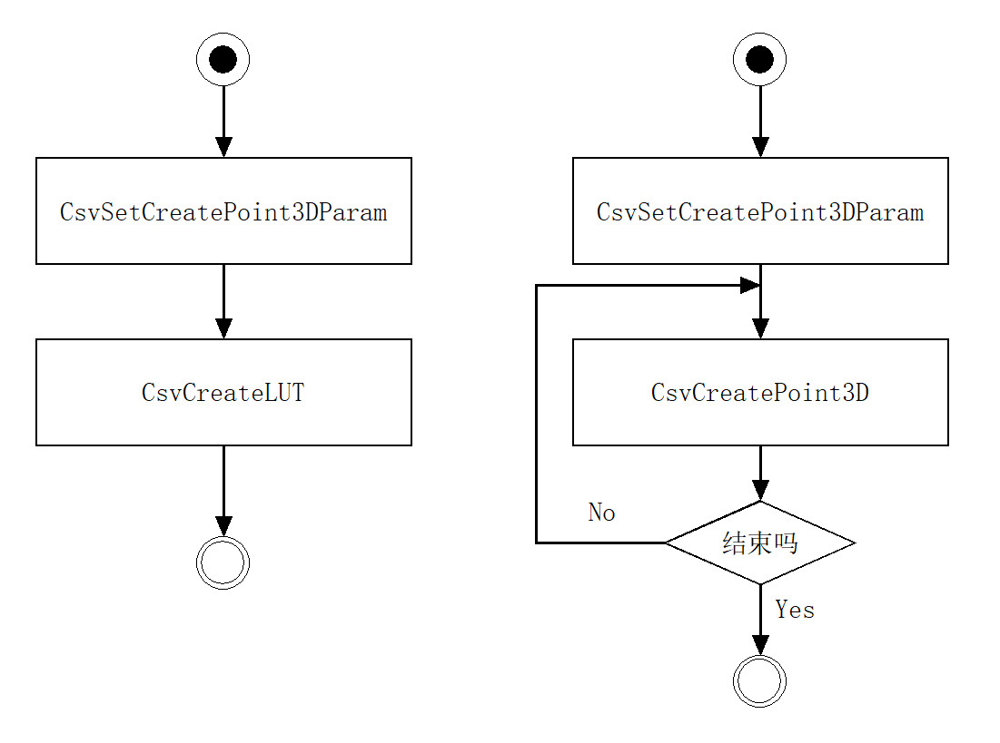

## 接口说明

| 接口名称 | 功能 |
| -------- | ---- |
| CsvSetCreatePoint3DParam | 把结构CsvCreatePoint3DParam传入系统 |
| CsvGetCreatePoint3DParam | 导出结构CsvCreatePoint3DParam |
| CsvCreateLUT | 创建系统运行需要的查找表（LUT） 传入参数是结构CsvCreatePoint3DParam；函数目标：生成正常运行时需要的查找表。调用方法：根据输入的xml文件，运行一次生成查找表即可。 |
| CsvCreatePoint3D	| 传入结构光图像组，传出深度图和点云。输入参数：inImages：CsvImageSimple类型的图像组（左右眼图像分组存放） depthImage：传出的深度图（左眼坐标系）point3D：传出的点云 |


## 版本说明

*****************************************************************************
V3.0.0.20221020
1、计算点云和深度图的功能都放入GPU内执行
*****************************************************************************
V2.0.1.3.20220808
1、修改了使用平面或其它模型坐标更新模型Z坐标
2、修改了calibWithGivenPnt3Ds.exe程序，使用8个点
*****************************************************************************
V2.0.1.20220728
1、添加了获取错误码信息接口（中文信息）
2、添加了calibWithGivenPnt3Ds.exe程序，可用戳点的方式更新世界坐标系
*****************************************************************************
V2.0.0.20220704
1、修改了抓取干涉判断逻辑，提高了抓取干涉判断效率
*****************************************************************************
V1.9.14.20220629
1、添加了抓取排序枚举名称
*****************************************************************************
V1.9.13.20220629
1、添加了抓取排序参数，提供多种抓取排序方法
2、改善了基于崩塌检测的速度问题
*****************************************************************************
V1.9.12.20220620
1、允许加载同名模型
*****************************************************************************
V1.9.11.20220618
1、完善了手眼信息修改接口，添加了直接使用抓取点进行纠偏的方法
2、添加了HDIR中获取当前合成图像张数接口
3、修改了获取模型ID接口，获取ID的同时可获取模型文件名名；不再支持对同一文件名的模型进行重复加载
4、删除了识别参数sortPickPriorityWithCollPoints、sortPickPriorityWithPickDis、m_BoxPointCheckThr及m_collisionDisThrBasketRobot四个参数
*****************************************************************************
V1.9.10.20220614
1、添加了指定方向识别发生偏移的处理方法，包括位置偏移及绕Z轴旋转偏移
*****************************************************************************
V1.9.9.20220610
1、修改了高动态中海康相机的相应函数
2、修改了深框干涉中的抓取方向检查函数
3、初步测试程序当前程序满足眼在手上的深框抓取动作
4、修改了模型制作接口
*****************************************************************************
V1.9.8.5.20220531
1、自动计算夹爪与STL模型之间的干涉距离
2、自动计算夹爪与点云干涉的voxel大小
*****************************************************************************
V1.9.8.4.20220531
1、东本现场测试版本，为绕Z周期变化的工件自动添加候选解已防止漏解
2、夹爪与STL干涉距离设为-1，暂时未添加变量储存
3、修改了抓取函数部分逻辑
*****************************************************************************
V1.9.8.3.20220529
1、修改点云生成时默认计算法向量
*****************************************************************************
V1.9.8.2.20220527
1、修改了高动态图像设置边缘阈值的BUG
*****************************************************************************
V1.9.8.20220525
1、识别条纹曝光自动计算分级
2、添加随机光点云生成接口
3、修改了点云生成的BUG
4、深框加载时判断，初始化垂直抓取范围、渐进抓取范围等参数
5、夹爪模型中添加了与制作相关的参数，这些参数在碰撞检测中未使用
6、加载标定文件与模型文件不匹配时只给出警告，未返回错误
8、在初始解搜索中使用3D范围判断，过滤大部分解，减少初始解数目
*****************************************************************************
V1.9.7.20220427
1、前期的警告输出失败，此版本可用
*****************************************************************************
V1.9.6.20220426
1、修改了排序中的一些错误
*****************************************************************************
V1.9.5.20220426
1、修改了排序中的一些奔溃BUG
*****************************************************************************
V1.9.4.20220426
1、修改了上一版本中深框设置中的问题
2、对一些特殊识别参数的日志输出改为警告输出
*****************************************************************************
V1.9.3.20220415
1、添加了不加载模型的情况下从模型中获取默认识别参数的接口csvPilotEngineGetFindParam()
2、添加了csvPilotEngineSetRobotCollisionInfo()对多深框的支持，与夹爪模型一致，使用深框ID对其进行区分管理；修改了深框保存的文件格式，兼容以前的单深框文件
3、修改了对夹爪干涉（不使用深框）的支持，可只加载夹爪模型而不加载深框模型(csvPilotEngineSetRobotCollisionInfo()深框参数可置为NULL)
4、添加了排序方法(特别是曝光度、深框中点距离)的支持，已实现绝大部分排序方法
5、修改了部分基础类的构造函数为显式调用而非隐式转换
*****************************************************************************
V1.9.2.20220408
1、添加了输出结果中的使用的深框ID，便于软件显示使用
*****************************************************************************
V1.9.2.20220407
1、优化了标定板自动检测算法，极大缩小图像采集次数
2、添加了按照工件曝光度的排序方法
3、双夹爪模型默认固定两夹爪宽度
4、在夹爪干涉情况下可单独加载夹爪模型而不是一定要同时加载深框模型，即使深框干涉未使用
5、加载深框及夹爪时自动生成深框STL模型及夹爪STL模型，可用于深框及干涉仿真显示
*****************************************************************************

## 调用流程




## 测试Demo

```cpp

#include <iostream>
#include <string>
#include <vector>
#include <fstream>
#include <stdexcept>
#include <opencv2/opencv.hpp>

#include "csvCreatePoint3D.hpp"
#include "CsvTimer.hpp"

std::string to_zero_lead(const int value, const unsigned precision)
{
	std::ostringstream oss;
	oss << std::setw(precision) << std::setfill('0') << value;
	return oss.str();
}

void loadSrcImage005(std::string& pathRoot, std::string& folder, std::vector<std::vector<cv::Mat>>& imgGroupList)
{
	//std::string folder_2391 = "B9w-dlp600-3\\";
	//std::string folder_2023 = "B9w-dlp600-3\\";

	std::vector<std::string> C_2391 = {
		"CSV_001C1S00P001.bmp",
		"CSV_001C1S00P002.bmp",
		"CSV_001C1S00P003.bmp",
		"CSV_001C1S00P004.bmp",
		"CSV_001C1S00P005.bmp",
		"CSV_001C1S00P006.bmp",
		"CSV_001C1S00P007.bmp",
		"CSV_001C1S00P008.bmp",
		"CSV_001C1S00P009.bmp",
		"CSV_001C1S00P010.bmp",
		"CSV_001C1S00P011.bmp",
		"CSV_001C1S00P012.bmp",
		"CSV_001C1S00P013.bmp"
	};
	std::vector<std::string> C_2023 = {
		"CSV_001C2S00P001.bmp",
		"CSV_001C2S00P002.bmp",
		"CSV_001C2S00P003.bmp",
		"CSV_001C2S00P004.bmp",
		"CSV_001C2S00P005.bmp",
		"CSV_001C2S00P006.bmp",
		"CSV_001C2S00P007.bmp",
		"CSV_001C2S00P008.bmp",
		"CSV_001C2S00P009.bmp",
		"CSV_001C2S00P010.bmp",
		"CSV_001C2S00P011.bmp",
		"CSV_001C2S00P012.bmp",
		"CSV_001C2S00P013.bmp"
	};
	// 导入C1相机图像
	std::vector<cv::Mat> src1list;
	for (int i = 0; i < 13; i++) {
		std::string path = pathRoot + folder + C_2391[i];

		std::cout << "Read Image : " << path << std::endl;

		cv::Mat im = cv::imread(path, cv::IMREAD_GRAYSCALE);
		if (im.empty()) {
		     throw std::invalid_argument( "Read Image Error !!" );
		     return ;
		}

		src1list.emplace_back(im);
	}
	imgGroupList.push_back(src1list);
	std::cout << "Read Image Num : " << src1list.size() << std::endl;

	// 导入2相机图像
	std::vector<cv::Mat> src2list;
	for (int i = 0; i < 13; i++) {
		std::string path = pathRoot + folder + C_2023[i];

		std::cout << "Read Image : " << path << std::endl;

		cv::Mat im = cv::imread(path, cv::IMREAD_GRAYSCALE);
		if (im.empty()) {
		     throw std::invalid_argument( "Read Image Error !!" );
		     return ;
		}
		src2list.emplace_back(im);

	}
	imgGroupList.push_back(src2list);
	std::cout << "Read Image Num : " << src2list.size() << std::endl;
	return;
}

std::vector<std::string> dataFolders = {
"B8w-dlp700-4",
"B9w-dlp500-3",
"B9w-dlp600-3",
"B9w-dlp700-3",
"B9w-dlp700-4"
};

bool ParseDepthImage2CVMat(CSV::CsvImageSimple &depthImage, cv::Mat& out) {
	out = cv::Mat(depthImage.m_height, depthImage.m_width, CV_16U, depthImage.m_data.data());
	out.row(0) = cv::Scalar(0);
	return true;
}

int main(int argc, char* argv[])
{
	int inputCommand = 1;
	for (int i = 0; i < argc; i++)
		cout << argv[i] << endl;
	if (argc == 2) {
		inputCommand = std::atoi(argv[1]);
	}

	std::string modelFolder = "./";
	std::string pathRoot = "/home/cosmosvision/markguo/";

	CSV::CsvCreatePoint3DParam param;
	param.calibXml = pathRoot + std::string("calibNew20220719.xml");
	param.modelPathFolder = modelFolder;

	param.type = CSV::CSV_DataFormatType::FixPoint16bits;

  if (inputCommand == 0){
    std::cout << "Create LUT Begin ..." << std::endl;
    CsvCreateLUT(param);
    std::cout << "Create LUT Over" << std::endl;
    return 1;
  }

	CsvSetCreatePoint3DParam(param); //set params

	CSV::CsvCreatePoint3DParam param0;
	CsvGetCreatePoint3DParam(param0);
	std::cout << "Calib XML : " << param0.calibXml << std::endl;
	std::cout << "Model Path Root : " << param0.modelPathFolder << std::endl;
	std::cout << param0.type << std::endl;

	for (size_t iFileGroup = 0; iFileGroup < dataFolders.size(); iFileGroup++) {
		std::string folder = dataFolders[iFileGroup] + "/";

		std::string imgRoot = pathRoot;
		std::vector<std::vector<cv::Mat>> imgGroupList;

		loadSrcImage005(imgRoot, folder, imgGroupList);

		std::vector<std::vector<CSV::CsvImageSimple>> imageGroups;

		int rows = imgGroupList[0][0].rows, cols = imgGroupList[0][0].cols;
		for (int g = 0; g < imgGroupList.size(); g++) {
			std::vector<CSV::CsvImageSimple> imgs;
			for (int i = 0; i < imgGroupList[g].size(); i++) {
				CSV::CsvImageSimple img(rows, cols, 1, imgGroupList[g][i].data);
				imgs.emplace_back(img);
			}
			imageGroups.emplace_back(imgs);
		}

		CSV::CsvImageSimple depthImage;
		std::vector<float> point3D;

		CsvTimer timer;

		bool result = CsvCreatePoint3D(imageGroups, depthImage, &point3D);

		std::cout << "CsvCreatePoint3D Timer ms :" << timer.elapsed() << std::endl;

		std::string outPngFilename = modelFolder + "Range_" + std::to_string(iFileGroup) + ".png";
		cv::Mat outPng;
		ParseDepthImage2CVMat(depthImage, outPng);
		cv::Mat vdisp;
		cv::normalize(outPng, vdisp, 0, 256, cv::NORM_MINMAX, CV_8U);
		cv::imwrite(outPngFilename, vdisp);

		std::string outPointCloudFilename = modelFolder + "PointCloud_" + std::to_string(iFileGroup) + ".xyz";
		cv::Mat out3D = cv::Mat(rows, cols, CV_32FC3, point3D.data());
		std::ofstream outfile(outPointCloudFilename);
		for (int i = 0; i < out3D.rows; i++) {
			cv::Vec3f *p0 = out3D.ptr<cv::Vec3f>(i);
			for (int j = 0; j < out3D.cols; j++) {
				cv::Vec3f p = p0[j];
				if (std::isnan(p[0]) || std::isnan(p[1]) || std::isnan(p[2])) {
					continue;
				}
				outfile << p[0] << " " << p[1] << " " << p[2] << " " << "\n";
			}
		}
		outfile.close();
	}

	return 0;
}


```